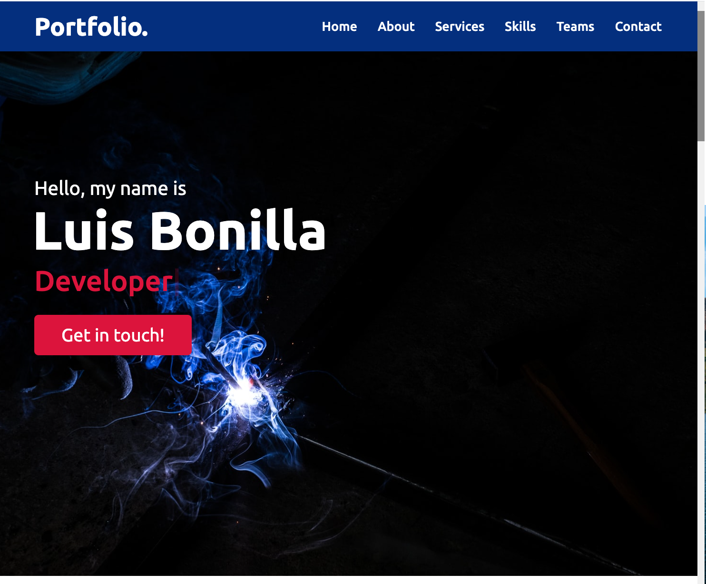

# Homework 8 Updated Portfolio

## Overview:

The purpose of this assignment was to update and refine the existing portfolio website highlighting the developed applications.

## Implementation Details

1. Incorporation of HTML file, stucturing the entire document while following semantics.

2. Consolidated redundancy in CSS file of some of the styling properties by grouping selector types under the same conditions.

3. Utilising third party API's such as Jquery as well as Bootstrap framework for some of the styling properties

## Screenshot

## Deployed Application

Please click the following link:

https://luisbonilla89.github.io/Portfolio-New/

# Lisence

MIT
